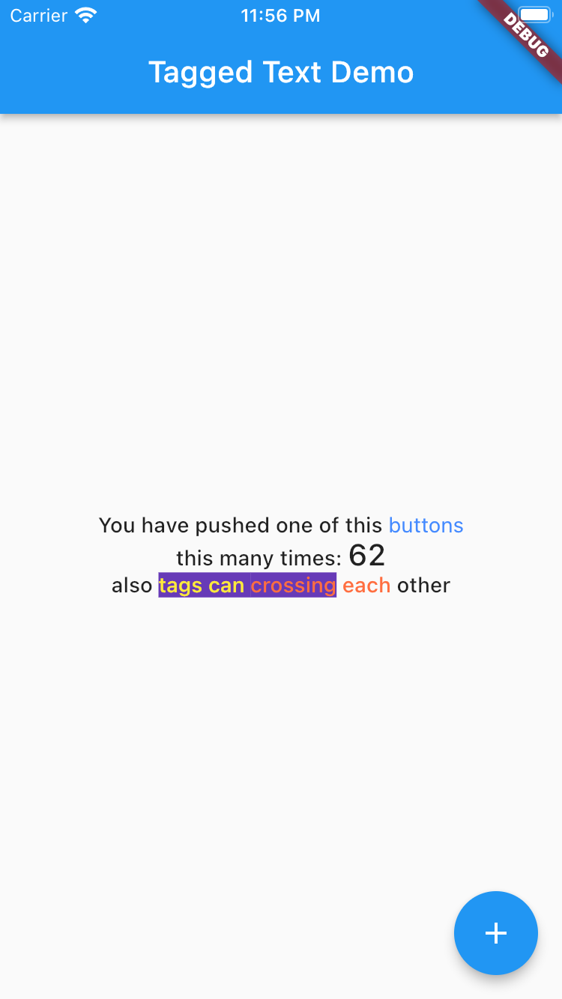

<!-- 
This README describes the package. If you publish this package to pub.dev,
this README's contents appear on the landing page for your package.

For information about how to write a good package README, see the guide for
[writing package pages](https://dart.dev/guides/libraries/writing-package-pages). 

For general information about developing packages, see the Dart guide for
[creating packages](https://dart.dev/guides/libraries/create-library-packages)
and the Flutter guide for
[developing packages and plugins](https://flutter.dev/developing-packages). 
-->

The `TaggedText` library allow easy building tagged text as `RichText`.

Allow build `RichText` with `TextSpan` by tagged text.

## Installation

Add on pubspec.yml:

```
dependencies:
  tagged_text: ... // latest package version
```

## Usage

See example in `/example` folder. 

```dart
import 'package:tagged_text/tagged_text.dart';

@override
Widget build(BuildContext context) {
  final textTheme = Theme.of(context).textTheme;
  return Scaffold(
    appBar: AppBar(
      title: Text(widget.title),
    ),
    body: Center(
      child: Column(
        mainAxisAlignment: MainAxisAlignment.center,
        children: <Widget>[
          //
          // THIS IS A BEGINNING of [TaggedText].
          //
          TaggedText(
            textAlign: TextAlign.center,
            // A tagged string.
            text: 'You have pushed one of this <b>buttons</b>\n'
                'this many times: <v>$_counter</v>\n'
                'also <hl>tags can <hr>crossing</hl> each</hr> other',
            // A settings for root TextSpan.
            rootSettings: TagSettings(style: textTheme.bodyText1),
            // A settings for each tag.
            tagsSettings: <String, TagSettings>{
              // Tag 'b' with blueAccent color and action on tap.
              'b': TagSettings(
                style: textTheme.bodyText2?.apply(color: Colors.blueAccent),
                recognizer: TapGestureRecognizer()
                  ..onTap = () {
                    _incrementCounter();
                  },
              ),
              // Tag 'v' with specific theme.
              'v': TagSettings(style: textTheme.headline6),
              // Tags 'hl' and 'hr' crossing each other with merging its settings.
              'hl': TagSettings(
                style: const TextStyle(
                  backgroundColor: Colors.deepPurple,
                  color: Colors.yellow,
                ),
              ),
              'hr': TagSettings(
                style: const TextStyle(
                  color: Colors.deepOrangeAccent,
                ),
              ),
            },
          ),
          //
          // THIS IS A ENDING of [TaggedText].
          //
          const SizedBox(height: 30),
          // ... one more thing
          // if you want use [TaggedText] only with different [TextStyle]s
          // feel free to use it.
          TaggedText.style(
            text: 'text <a>with <b>only</a> text</b> styles',
            rootStyle: textTheme.caption,
            tagsStyles: const <String, TextStyle>{
              'a': TextStyle(
                backgroundColor: Colors.blueAccent,
                color: Colors.yellow,
              ),
              'b': TextStyle(
                color: Colors.deepOrangeAccent,
              ),
            },
          )

        ],
      ),
    ),
    floatingActionButton: FloatingActionButton(
      onPressed: _incrementCounter,
      tooltip: 'Increment',
      child: const Icon(Icons.add),
    ),
  );
}

```


